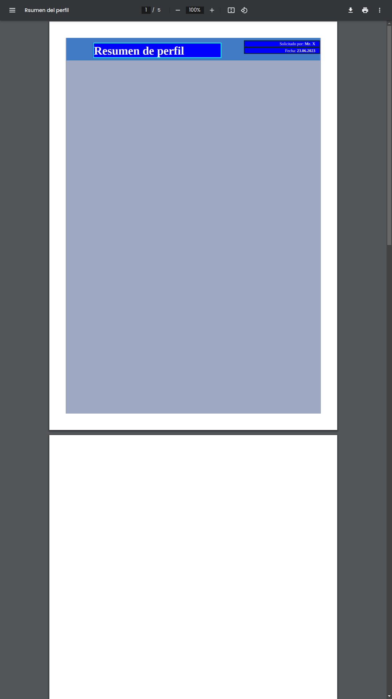

## Steps to follow to raise the project

- composer install
- npm run dev
- php artisan serve

## Situation

I saw this post:

https://www.itsolutionstuff.com/post/how-to-generate-pdf-with-graph-in-laravelexample.html

I am trying to do a simple example with highcharts instead of google charts.

But it is not rendering the graphic.

I 'm working with Laravel Framework 10.0.3 and PHP 8.1.18
